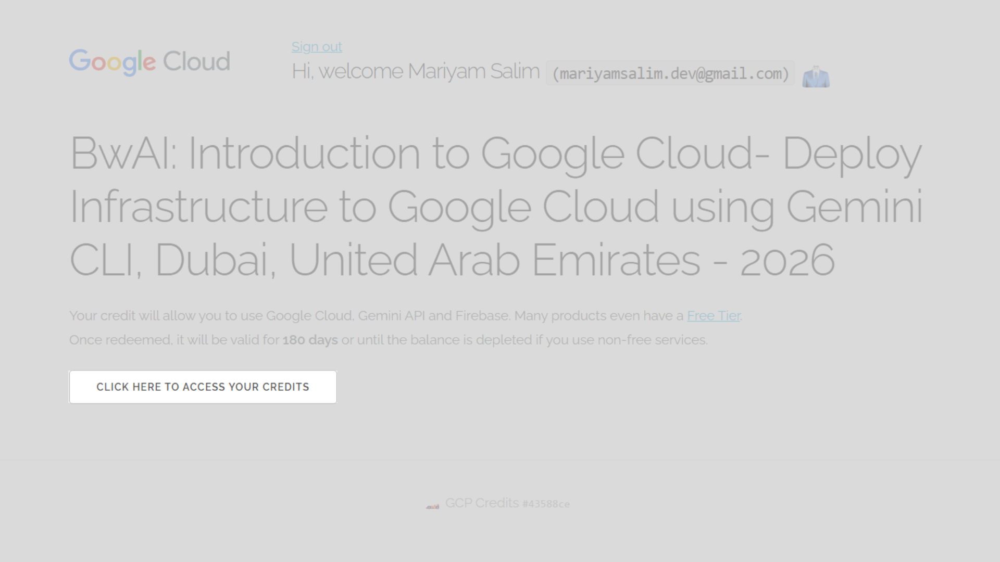
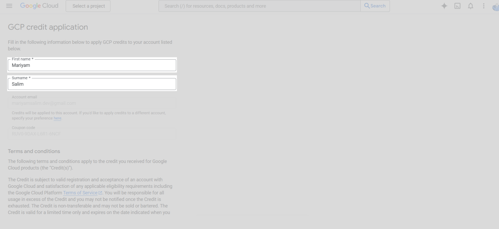
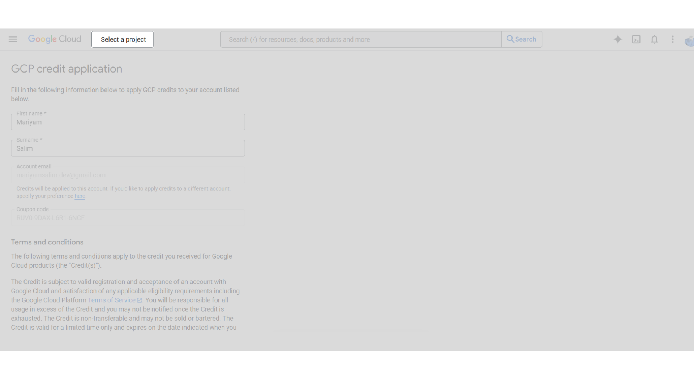
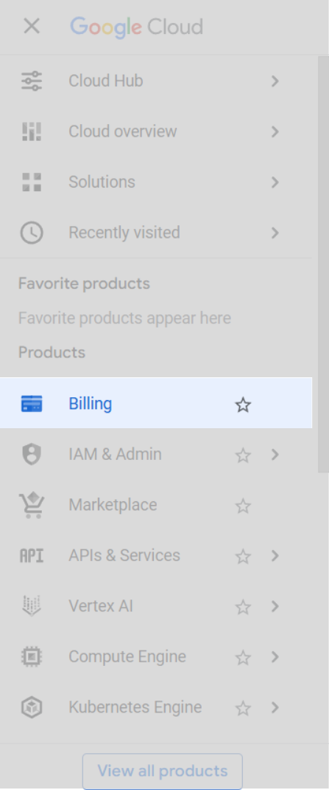
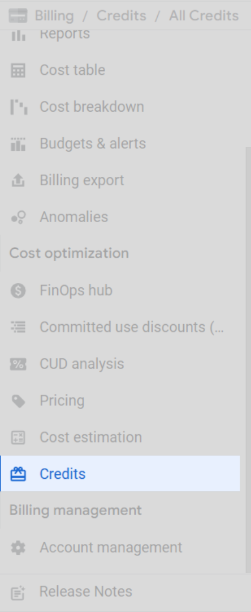
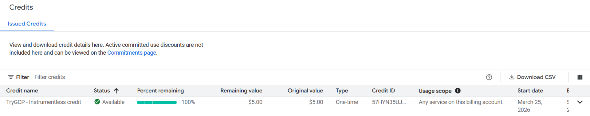

# Claiming GCP Credit for Workshop

This guide explains step-by-step how to easily claim your Google Cloud credits.

---

### 1. Visit the Credit Claim Page
Go to the provided URL. Click **“Sign in with Google”** — this will open the Google login page.

---

### 2. Claim Your Credits
After signing in, click the button to claim your GCP credits.

---

### 3. Fill Out Basic Information
Enter your **first name** and **last name**, then click **Accept and Continue** to complete the process.

---

### 4. Select project
Click **Select a project** and choose an existing or create new.

---

### 5. Verify Your Credits
Click **Billing** in the hamburger menu.

Scroll down and click on **Credits** to verify.

✅ That’s it — you’ve successfully claimed your GCP credits!

---

If you are unable to access your Google Cloud account due to MFA enforcement, follow [this guide ](./define-mfa.md) to regain access.

---

